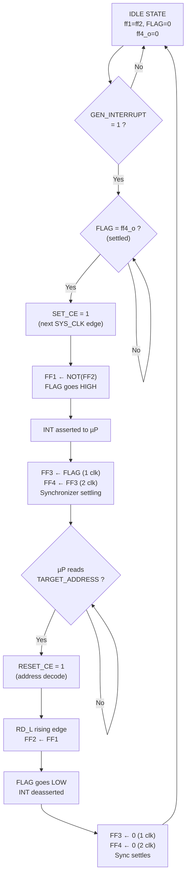

# Flancter — Cross-Clock-Domain Interrupt Handshake (VHDL)

    

A hardware implementation of the **Flancter circuit** — a robust cross-clock-domain signaling mechanism for generating and clearing interrupt requests between an FPGA and a microprocessor (µP).

---

## What Is a Flancter?

A Flancter is a **set/clear flip-flop pair** that safely passes an event across two independent clock domains without metastability hazards. It works by toggling rather than setting/clearing a single bit:

- **SET** (FPGA side): FF1 is set to `NOT(FF2)` → XOR output goes **HIGH** → interrupt asserted
- **CLEAR** (µP side): FF2 copies FF1 → XOR output goes **LOW** → interrupt cleared

The XOR of the two flip-flop outputs (`FLAG`) indicates whether an interrupt is pending.

---

## Project Structure

```
sources_1/new/
├── Flancter.vhd          # Core Flancter cell (FF1 + FF2 + XOR)
├── Flancter_uP_FPGA.vhd  # Top-level: sync chain, address decode, SET_CE logic
├── Flancter_App_Note.pdf  # Reference application note
└── readme.md              # This file
```

---

## Module Descriptions

### `Flancter.vhd` — Core Cell

The basic Flancter primitive with two flip-flops in separate clock domains.

| Port | Dir | Description |
|------|-----|-------------|
| `sys_clk` | in | Fast clock domain (FPGA) — drives FF1 |
| `reset_clk` | in | Slow clock domain (µP read strobe) — drives FF2 |
| `set_ce` | in | Clock enable for FF1 (set the flag) |
| `reset_ce` | in | Clock enable for FF2 (clear the flag) |
| `reset_async` | in | Asynchronous active-high reset |
| `flag` | out | `ff1_o XOR ff2_o` — HIGH when interrupt is pending |

### `Flancter_uP_FPGA.vhd` — Top-Level Wrapper

Wraps the Flancter cell with synchronization, address decode, and set-enable logic.

| Port | Dir | Domain | Description |
|------|-----|--------|-------------|
| `GEN_INTERRUPT_TO_uC` | in | FPGA | Request to generate an interrupt |
| `SYS_CLK` | in | FPGA | System clock |
| `RESET` | in | — | Async active-high reset |
| `INT` | out | — | Interrupt output to µP |
| `RD_L` | in | µP | Read strobe (active-low, rising edge clocks FF2) |
| `ADDRESS` | in | µP | Address bus from µP |

| Generic | Default | Description |
|---------|---------|-------------|
| `ADDRESS_W` | 32 | Address bus width |
| `TARGET_ADDRESS` | `0xABCD00A5` | Address the µP reads to clear the interrupt |

**Internal signals:**
- **FF3, FF4** — Double-synchronizer chain bringing `FLAG` into `SYS_CLK` domain
- **SET_CE** — Asserted when `FLAG = ff4_o` (settled) and `GEN_INTERRUPT_TO_uC = '1'`
- **RESET_CE** — Asserted when `ADDRESS = TARGET_ADDRESS`

---

## Circuit Diagrams

### Core Flancter Cell (`Flancter.vhd`)

```
                      ┌─────────────────────────────────────────────────┐
                      │              Flancter Cell                      │
                      │                                                 │
  reset_async ────────┼──────────────┬──────────────────────────────┐   │
                      │              │                              │   │
                      │         ┌────▼─────┐                  ┌────▼─────┐
                      │         │  ASYNC    │                  │  ASYNC    │
                      │         │  CLR      │                  │  CLR      │
  sys_clk ────────────┼────────►│ CLK      │    reset_clk ───►│ CLK      │
                      │         │          │                   │          │
  set_ce  ────────────┼────────►│ CE   FF1 │    reset_ce ────►│ CE   FF2 │
                      │         │          │         ┌────────►│ D        │
                      │    ┌───►│ D     Q  ├────┬────┼────┐    │       Q  ├──┐
                      │    │    └──────────┘    │    │    │    └──────────┘  │
                      │    │                   │    │    │                   │
                      │    │    ┌──────────┐   │    │    │                   │
                      │    │    │          │   │    │    └───────────────────┤
                      │    └────┤   NOT    │◄──┼────┘                       │
                      │         └──────────┘   │          ff1_o             │
                      │                        │                     ff2_o  │
                      │                   ┌────▼────┐                       │
                      │                   │         │◄──────────────────────┘
                      │                   │   XOR   │
                      │                   │         │
                      │                   └────┬────┘
                      │                        │
                      └────────────────────────┼────────────────────────────┘
                                               │
                                            flag (out)
```

**Logic:**
- `FF1.D = NOT(ff2_o)` — FF1 toggles relative to FF2
- `FF2.D = ff1_o` — FF2 copies FF1 to clear
- `flag = ff1_o XOR ff2_o` — mismatch = interrupt pending

---

### Full Top-Level Design (`Flancter_uP_FPGA.vhd`)

```
   ═══════════════════════ SYS_CLK DOMAIN ═════════════════════════   ║  ═══ RD_L DOMAIN ═══
                                                                      ║
   GEN_INTERRUPT_TO_uC                                                ║
          │                                                           ║
          ▼                                                           ║
   ┌─────────────────┐                                                ║
   │   P_SET_CE       │     SET_CE                                    ║
   │                  │────────────────────────────┐                  ║
   │ if FLAG = ff4_o  │                            │                  ║
   │ AND GEN_INT = 1  │                            │                  ║
   │ then SET_CE = 1  │                            │                  ║
   └───────┬──────────┘                            │                  ║
           │                                       │                  ║
           │  ff4_o                                ▼                  ║
           │                            ┌──────────────────┐          ║   ┌─────────────────┐
           │                            │                  │          ║   │                 │
           │                            │   ┌──────────┐   │  ff1_o   ║   │  ┌──────────┐  │
           │                            │   │          │   ├──────────╫───┼─►│          │  │
           │                            │   │   FF1    │   │          ║   │  │   FF2    │  │
           │                            │   │  SYS_CLK │   │          ║   │  │  RD_L    │  │
           │                            │   │          │◄──┼──────────╫───┼──┤       Q  ├──┼──┐
           │                            │   └──────────┘   │          ║   │  └──────────┘  │  │
           │                            │                  │          ║   │       ▲         │  │
           │                            │   ┌──────────┐   │          ║   │       │ RESET_CE│  │
           │                            │   │   XOR    ├───┼── FLAG   ║   │       │         │  │
           │                            │   └──────────┘   │   │      ║   └───────┼─────────┘  │
           │                            │  FLANCTER CELL   │   │      ║           │       ff2_o│
           │                            └──────────────────┘   │      ║   ┌───────┴─────────┐  │
           │                                                   │      ║   │  P_ADDR_DECODE  │  │
           │                                                   │      ║   │                 │  │
           │         ┌──────────┐     ┌──────────┐             │      ║   │ if ADDR = TARGET│  │
           │         │          │     │          │             │      ║   │ then RSET_CE=1  │  │
           │         │   FF4    │◄────┤   FF3    │◄────────────┘      ║   └───────▲─────────┘  │
           │         │  SYS_CLK │     │  SYS_CLK │                    ║           │            │
           │         │       Q  ├──┐  │          │   double-sync      ║    ADDRESS[n:0]        │
           │         └──────────┘  │  └──────────┘   chain            ║                        │
           │                       │                                  ║                        │
           └───────────────────────┘                                  ║                        │
              ff4_o loops back to                                     ║                        │
              SET_CE settling check                                   ║                        │
                                                                      ║                        │
                              FLAG ═══════════════════════════════════►║══ INT (to µP)          │
                                                                      ║                        │
                                                                      ║                        │
   RESET ─────────────────── async reset to FF1, FF2, FF3, FF4 ──────╫────────────────────────┘
```

---

## Operation Flowchart



---

## Timing Diagram

```
              SET                              CLEAR
              event                            event
               │                                │
               ▼                                ▼
SYS_CLK   ────┐  ┌──┐  ┌──┐  ┌──┐  ┌──┐  ┌──┐  ┌──┐  ┌──┐  ┌──
              └──┘  └──┘  └──┘  └──┘  └──┘  └──┘  └──┘  └──┘

SET_CE    ────┐  ┌─────────────────────────────────────────────────
           ___┘  └────────────────────────────────────────────────

ff1_o     ────────┐                                    ┌──────────
           _______┘  (set to NOT ff2_o = 1)            └──────────

FLAG      ────────┐                              ┌─────┘
           _______┘  (ff1 XOR ff2 = 1)           └────────────────

ff3_o     ───────────────┐                          ┌─────────────
           ______________┘  (+1 SYS_CLK)            └─────────────

ff4_o     ──────────────────────┐                       ┌─────────
           _____________________┘  (+2 SYS_CLK)        └─────────

INT       ────────┐                              ┌────────────────
           _______┘  (= FLAG)                    └────────────────

RD_L      ─────────────────────────────────┐  ┌──────────────────
           (µP reads target addr)          └──┘  (rising edge)

ff2_o     ───────────────────────────────────────┐
           ______________________________________┘  (copies ff1)

RESET_CE  ─────────────────────────────┐        ┌─────────────────
           ____________________________┘________└─────────────────
                                       (addr match)
```

---

## Clock Domain Crossing Safety

| Mechanism | Purpose |
|-----------|---------|
| FF1 on `SYS_CLK`, FF2 on `RD_L` | Flancter toggle-handshake avoids CDC issues |
| FF3 → FF4 double-sync | Safely brings `FLAG` into `SYS_CLK` domain |
| `FLAG = ff4_o` guard | Prevents re-triggering during synchronizer settling |

## Quick Start

1. Add both `.vhd` files to your Vivado project
2. Set `Flancter_uP_FPGA` as the top module
3. Configure generics (`ADDRESS_W`, `TARGET_ADDRESS`) for your system
4. Connect `INT` to µP interrupt input, `RD_L` and `ADDRESS` to µP bus
5. Drive `GEN_INTERRUPT_TO_uC` from your FPGA logic when an event occurs
