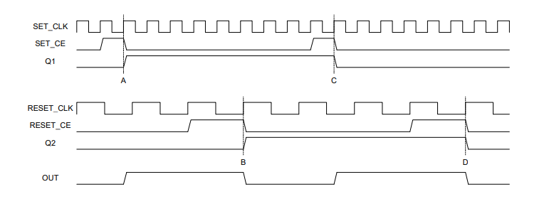

# Flancter -- Cross-Clock-Domain Interrupt Handshake (VHDL)

    

A hardware implementation of the **Flancter circuit** -- a robust cross-clock-domain signaling mechanism for generating and clearing interrupt requests between an FPGA and a microprocessor (uP).

---

## What Is a Flancter?

A Flancter is a **set/clear flip-flop pair** that safely passes an event across two independent clock domains without metastability hazards. It uses a `FLAG` output (XOR of two flip-flops) to indicate interrupt status:

| `FLAG` | Meaning |
|--------|---------|
| `1` | Interrupt pending -- FPGA has requested attention |
| `0` | No interrupt -- uP has acknowledged and cleared |

---

## Project Structure

```
sources_1/new/
+-- Flancter.vhd          # Core Flancter cell (FF1 + FF2 + XOR)
+-- Flancter_uP_FPGA.vhd  # Top-level: sync chain, address decode, SET_CE logic
+-- Flancter_App_Note.pdf  # Reference application note
+-- readme.md              # This file
```

---

## Module Descriptions

### `Flancter.vhd` -- Core Cell

The basic Flancter primitive with two flip-flops in separate clock domains.

| Port | Dir | Description |
|------|-----|-------------|
| `sys_clk` | in | Fast clock domain (FPGA) -- drives FF1 |
| `reset_clk` | in | Slow clock domain (uP read strobe) -- drives FF2 |
| `set_ce` | in | Clock enable for FF1 (set the flag) |
| `reset_ce` | in | Clock enable for FF2 (clear the flag) |
| `reset_async` | in | Asynchronous active-high reset |
| `flag` | out | `ff1_o XOR ff2_o` -- HIGH when interrupt is pending |

### `Flancter_uP_FPGA.vhd` -- Top-Level Wrapper

Wraps the Flancter cell with synchronization, address decode, and set-enable logic.

| Port | Dir | Domain | Description |
|------|-----|--------|-------------|
| `GEN_INTERRUPT_TO_uC` | in | FPGA | Request to generate an interrupt |
| `SYS_CLK` | in | FPGA | System clock |
| `RESET` | in | -- | Async active-high reset |
| `INT` | out | -- | Interrupt output to uP |
| `RD_L` | in | uP | Read strobe (active-low, rising edge clocks FF2) |
| `ADDRESS` | in | uP | Address bus from uP |

| Generic | Default | Description |
|---------|---------|-------------|
| `ADDRESS_W` | 32 | Address bus width |
| `TARGET_ADDRESS` | `0xABCD00A5` | Address the uP reads to clear the interrupt |

**Internal signals:**
- **FF3, FF4** -- Double-synchronizer chain bringing `FLAG` into `SYS_CLK` domain
- **SET_CE** -- Asserted when `FLAG = ff4_o` (settled) and `GEN_INTERRUPT_TO_uC = '1'`
- **RESET_CE** -- Asserted when `ADDRESS = TARGET_ADDRESS`

---

## Circuit Diagrams

### Core Flancter Cell (`Flancter.vhd`)


**Logic:**
- `FF1.D = NOT(Q2)` -- FF1 toggles relative to FF2
- `FF2.D = Q1` -- FF2 copies FF1 to clear
- `OUT = Q1 XOR Q2` -- mismatch = interrupt pending

---

### Full Top-Level Design (`Flancter_uP_FPGA.vhd`)


---

### Timing Diagrams




---

## Operation Flowchart


---

## Working Principle

### 1. Idle State (no interrupt)

Both flip-flops hold the same value (`Q1 = Q2`), so `FLAG = Q1 XOR Q2 = 0`. The `INT` line is **LOW** -- no interrupt is pending. The synchronizer outputs (`ff3_o`, `ff4_o`) have settled to `0`, so `FLAG = ff4_o` is true and the system is ready to accept a new interrupt request.

### 2. Setting the Interrupt (FPGA side)

When the FPGA logic needs to signal the uP, it asserts `GEN_INTERRUPT_TO_uC = '1'`.

| What happens | Signal effect |
|---|---|
| `SET_CE` goes **HIGH** | Because `FLAG = ff4_o` (settled) AND `GEN_INTERRUPT = '1'` |
| On next `SYS_CLK` rising edge, `FF1.D = NOT(Q2)` latches | `Q1` flips to the opposite of `Q2` |
| `FLAG = Q1 XOR Q2` becomes **`1`** | Because `Q1 != Q2` now |
| `INT` goes **HIGH** | `INT <= FLAG`, interrupt is asserted to the uP |
| `SET_CE` goes **LOW** on next clock | Because `FLAG != ff4_o` (ff4_o still holds old value, synchronizer hasn't settled) |

> **Key point:** `SET_CE` is only HIGH for **one clock cycle**. After that, the `FLAG != ff4_o` guard blocks further sets until the system settles again. This prevents double-triggering.

### 3. Synchronizer Settling (FF3/FF4)

The `FLAG` signal propagates through the double-synchronizer chain in the `SYS_CLK` domain:

| Clock cycle | `ff3_o` | `ff4_o` | `FLAG = ff4_o ?` |
|---|---|---|---|
| +0 (FLAG just went HIGH) | `0` | `0` | No (blocked) |
| +1 | `1` | `0` | No (blocked) |
| +2 | `1` | `1` | Yes (but harmless -- FF1 re-latches same value) |

> **Why this matters:** The synchronizer ensures that `SET_CE` logic in the `SYS_CLK` domain only sees a stable, metastability-free version of `FLAG`. During the 2-cycle settling window, `SET_CE` stays LOW, preventing glitchy re-triggers.

### 4. Clearing the Interrupt (uP side)

The uP sees `INT = HIGH` and responds by reading the designated `TARGET_ADDRESS`:

| What happens | Signal effect |
|---|---|
| uP places `TARGET_ADDRESS` on the address bus | `RESET_CE` goes **HIGH** (address decode match) |
| uP asserts `RD_L` (active-low read strobe) | `RD_L` goes LOW then back HIGH |
| On `RD_L` **rising edge**, `FF2.D = Q1` latches | `Q2` copies `Q1`, so `Q1 = Q2` again |
| `FLAG = Q1 XOR Q2` becomes **`0`** | Because `Q1 = Q2` now |
| `INT` goes **LOW** | Interrupt is cleared |
| `RESET_CE` goes **LOW** | Address bus moves to a different address |

> **Key point:** The interrupt is cleared by a **read operation** -- the uP doesn't need to write anything. Simply reading the target address triggers `RD_L` which clocks FF2.

### 5. Recovery and Re-arm

After clearing, the synchronizer needs 2 more `SYS_CLK` cycles to settle `ff3_o` and `ff4_o` back to `0`. Once `FLAG = ff4_o = 0`, the Flancter is **re-armed** and ready for the next interrupt.

### Signal Lifecycle Summary

```
  GEN_INTERRUPT:  ____/^^^^^^^^^^^^^\__________  (FPGA asserts when event occurs)

  SET_CE:         __________/^\_________________  (HIGH for 1 SYS_CLK cycle only)

  Q1 (FF1):       ___________/^^^^^^^^^^^^^^^^^^  (toggles on SET_CE)

  FLAG (INT):     ___________/^^^^^^^^^^\_______  (HIGH while Q1 != Q2)

  RD_L:           ^^^^^^^^^^^^^^^^^\_/^^^^^^^^^^  (uP read strobe, active-low)

  RESET_CE:       _________________/^^\_________  (HIGH when address matches)

  Q2 (FF2):       _____________________/^^^^^^^^  (copies Q1 on RD_L rising edge)

  ff3_o:          _____________/^^^^^^^^\___+2ck  (1 SYS_CLK delay of FLAG)

  ff4_o:          _______________/^^^^^^\_+2ck__  (2 SYS_CLK delay of FLAG)
```

## Clock Domain Crossing Safety

| Mechanism | Purpose |
|-----------|---------|
| FF1 on `SYS_CLK`, FF2 on `RD_L` | Flancter toggle-handshake avoids CDC issues |
| FF3 -> FF4 double-sync | Safely brings `FLAG` into `SYS_CLK` domain |
| `FLAG = ff4_o` guard | Prevents re-triggering during synchronizer settling |

## Quick Start

1. Add both `.vhd` files to your Vivado project
2. Set `Flancter_uP_FPGA` as the top module
3. Configure generics (`ADDRESS_W`, `TARGET_ADDRESS`) for your system
4. Connect `INT` to uP interrupt input, `RD_L` and `ADDRESS` to uP bus
5. Drive `GEN_INTERRUPT_TO_uC` from your FPGA logic when an event occurs
