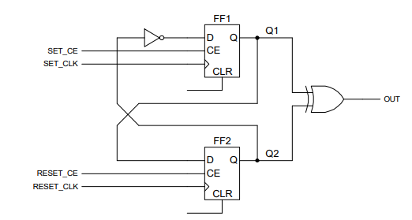
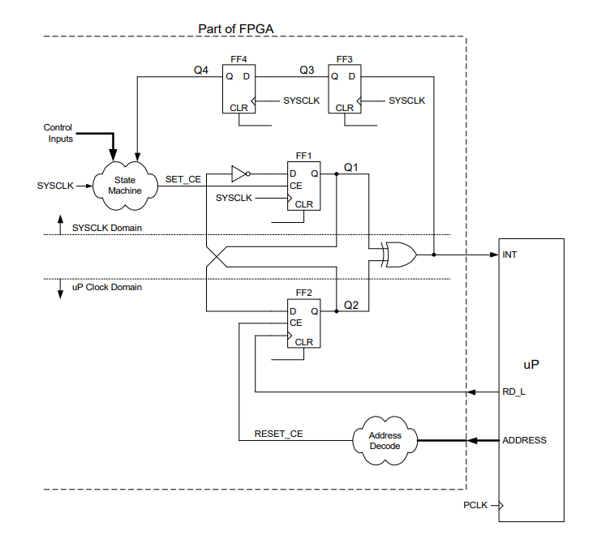
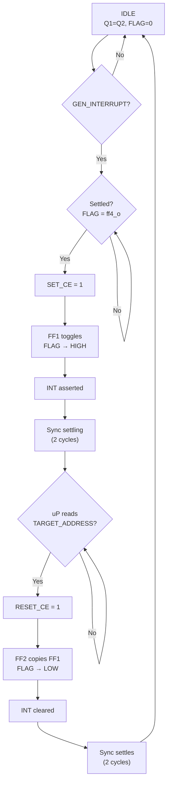
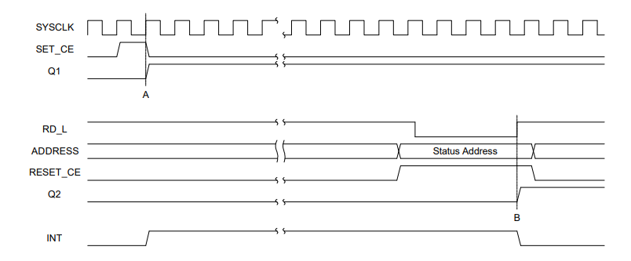

# Flancter — Safe Clock Domain Crossing for Interrupt Signaling (VHDL)

    

A **Flancter** is a set/clear flip-flop pair that safely passes events across two independent clock domains without metastability hazards. This implementation provides interrupt handshaking between an FPGA and a microprocessor (uP).

| `FLAG` | Meaning |
|:------:|---------|
| `1` | Interrupt pending — FPGA requests attention |
| `0` | Idle — uP has acknowledged and cleared |

---

## Quick Start

**Set interrupt (FPGA):** Assert `GEN_INTERRUPT_TO_uC` → `INT` goes HIGH  
**Clear interrupt (uP):** Read from `TARGET_ADDRESS` → `INT` goes LOW

---

## Project Structure

```
sources_1/new/
├── Flancter.vhd          # Core cell (FF1 + FF2 + XOR)
├── Flancter_uP_FPGA.vhd  # Top-level wrapper with sync chain and address decode
└── Flancter_App_Note.pdf # Reference application note
```

---

## Architecture Overview

### Core Flancter Cell (`Flancter.vhd`)

Two flip-flops in separate clock domains with XOR output:

```
FF1.D = NOT(Q2)    — toggles relative to FF2
FF2.D = Q1         — copies FF1 to clear
FLAG  = Q1 XOR Q2  — mismatch = interrupt pending
```



| Port | Dir | Description |
|------|:---:|-------------|
| `sys_clk` | in | FPGA clock — drives FF1 |
| `reset_clk` | in | uP read strobe — drives FF2 |
| `set_ce` | in | Clock enable for FF1 (set flag) |
| `reset_ce` | in | Clock enable for FF2 (clear flag) |
| `reset_async` | in | Async active-high reset |
| `flag` | out | HIGH when interrupt pending |

### Top-Level Wrapper (`Flancter_uP_FPGA.vhd`)

Adds synchronization, address decoding, and interlock logic.



**Ports:**

| Port | Dir | Domain | Description |
|------|:---:|:------:|-------------|
| `GEN_INTERRUPT_TO_uC` | in | FPGA | Trigger interrupt request |
| `SYS_CLK` | in | FPGA | System clock |
| `RESET` | in | — | Async active-high reset |
| `INT` | out | — | Interrupt output to uP |
| `RD_L` | in | uP | Active-low read strobe |
| `ADDRESS` | in | uP | Address bus |

**Generics:**

| Generic | Default | Description |
|---------|:-------:|-------------|
| `ADDRESS_W` | 32 | Address bus width |
| `TARGET_ADDRESS` | `0xABCD00A5` | Clear address |

**Key Internal Signals:**

| Signal | Function |
|--------|----------|
| `FF3`, `FF4` | Double-synchronizer: brings `FLAG` into `SYS_CLK` domain |
| `SET_CE` | HIGH when `FLAG = ff4_o` (settled) AND `GEN_INTERRUPT = '1'` |
| `RESET_CE` | HIGH when `ADDRESS = TARGET_ADDRESS` |

---

## How It Works

### Operation Flow



### Step-by-Step

#### 1. Idle State
- `Q1 = Q2` → `FLAG = 0` → `INT = LOW`
- Synchronizer settled: `FLAG = ff4_o = 0`
- System ready for new interrupt

#### 2. Set Interrupt (FPGA side)

| Event | Result |
|-------|--------|
| `GEN_INTERRUPT_TO_uC = '1'` | Triggers set sequence |
| `SET_CE → HIGH` (1 cycle only) | `FLAG = ff4_o` AND interrupt requested |
| `SYS_CLK` rising edge | FF1 latches `NOT(Q2)` |
| `Q1 ≠ Q2` | `FLAG → HIGH`, `INT → HIGH` |
| Next clock | `SET_CE → LOW` (guard blocks re-trigger) |

> **Note:** `SET_CE` pulses for exactly one clock cycle. The `FLAG ≠ ff4_o` guard prevents double-triggering until the synchronizer settles.

#### 3. Synchronizer Settling

`FLAG` propagates through FF3 → FF4 over 2 `SYS_CLK` cycles:

| Cycle | `ff3_o` | `ff4_o` | `SET_CE` blocked? |
|:-----:|:-------:|:-------:|:-----------------:|
| +0 | 0 | 0 | Yes |
| +1 | 1 | 0 | Yes |
| +2 | 1 | 1 | No (but harmless) |

This ensures `SET_CE` logic sees only metastability-free values.

#### 4. Clear Interrupt (uP side)

| Event | Result |
|-------|--------|
| uP places `TARGET_ADDRESS` on bus | `RESET_CE → HIGH` |
| `RD_L` goes LOW then HIGH | Rising edge clocks FF2 |
| FF2 latches `Q1` | `Q1 = Q2` → `FLAG → LOW` |
| `INT → LOW` | Interrupt cleared |

> **Note:** Clearing requires only a **read operation** — no write needed.

#### 5. Re-arm
After 2 more `SYS_CLK` cycles, `ff4_o = 0` and the Flancter is ready for the next interrupt.

---

## Timing Diagrams




### Signal Lifecycle

```
GEN_INTERRUPT:  ____/‾‾‾‾‾‾‾‾‾‾‾\__________   FPGA event trigger

SET_CE:         __________/‾\________________   1 cycle pulse

Q1 (FF1):       ___________/‾‾‾‾‾‾‾‾‾‾‾‾‾‾‾‾   Toggles on SET_CE

FLAG (INT):     ___________/‾‾‾‾‾‾‾‾‾‾\_____   HIGH while Q1 ≠ Q2

RD_L:           ‾‾‾‾‾‾‾‾‾‾‾‾‾‾‾‾‾\_/‾‾‾‾‾‾‾‾   uP read strobe

RESET_CE:       _________________/‾‾\_______   Address match

Q2 (FF2):       _____________________/‾‾‾‾‾‾   Copies Q1 on RD_L↑

ff3_o:          _____________/‾‾‾‾‾‾‾‾\_____   1-cycle delay

ff4_o:          _______________/‾‾‾‾‾‾\_____   2-cycle delay
```

---

## Clock Domain Crossing Safety

| Mechanism | Purpose |
|-----------|---------|
| FF1 on `SYS_CLK`, FF2 on `RD_L` | Toggle-handshake avoids CDC hazards |
| FF3 → FF4 double-sync | Brings `FLAG` safely into `SYS_CLK` domain |
| `FLAG = ff4_o` interlock | Prevents spurious triggers during settling |
| `FLAG = ff4_o` guard | Prevents re-triggering during synchronizer settling |

## Quick Start

1. Add both `.vhd` files to your Vivado project
2. Set `Flancter_uP_FPGA` as the top module
3. Configure generics (`ADDRESS_W`, `TARGET_ADDRESS`) for your system
4. Connect `INT` to uP interrupt input, `RD_L` and `ADDRESS` to uP bus
5. Drive `GEN_INTERRUPT_TO_uC` from your FPGA logic when an event occurs
